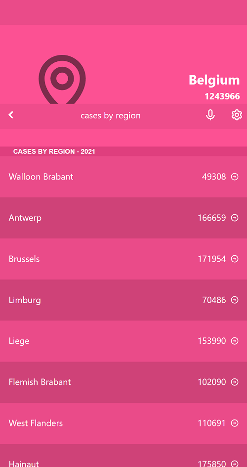

# Covid Figures

> Covid Figures is a web app that displays real-time data of confirmed covid cases across selected countries. When a user navigates to a country, additional breakdown of cases for that country is displayed across its different regions

## Built With

- React

## Getting Started

### Setup

#### To get a local copy up and running follow these simple example steps.

- Click the green `Code` button on the repo
- In your local PC, open your terminal in the folder you would like to clone the project.
- Clone the repo with the command: `git clone (copied link)`; like so: `git clone https://github.com/TedLivist/covid-figures.git`
- On the terminal, navigate into the directory like so: `cd covid-figures`
- Checkout to branch name like so: `git checkout [branch name]`
- Run `npm i` or `yarn` to install the dependencies
- Run `npm start` or `yarn start` to start the application

## Author

👤 **Teddy-Livingstone Ememandu**

- [GitHub](https://github.com/TedLivist)
- [LinkedIn](https://linkedin.com/in/tememandu)

## 🤝 Contributing

Contributions, issues, and feature requests are welcome!

Feel free to check the [issues page](../../issues/).

## Show your support

Give a ⭐️ if you like this project!

## Acknowledgments

- The design for this project was inspired by [Nelson Sakwa on Behance](https://www.behance.net/sakwadesignstudio). The design can be found [here](https://www.behance.net/gallery/31579789/Ballhead-App-(Free-PSDs))
- Inspiration